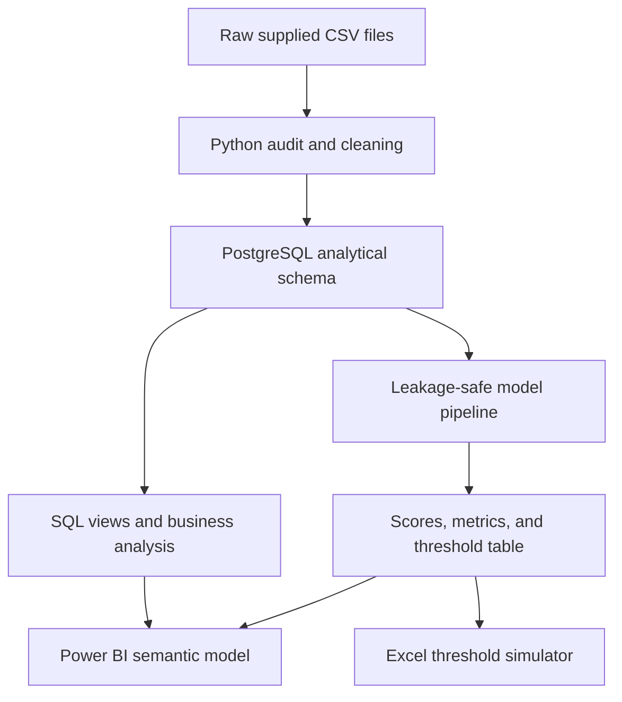

# Credit Risk Portfolio Analytics & Contractual-Term Default Scoring

End-to-end Data Analyst/Data Scientist portfolio project using **Python, PostgreSQL, SQL, Excel, and Power BI** on the supplied Credit Risk Dataset: 50K Loans, 10 Sectors.

> Honest scope: the target is default during each loan's **simulated contractual term**, not 12-month PD or real-time production scoring. The project is descriptive and predictive, not causal.

## Validated results from the supplied files

The Python/file pipeline was executed successfully on the attached dataset.

| Result | Actual value |
|---|---:|
| Loans | 50,000 |
| Sectors | 10 |
| Eventual defaults | 6,950 |
| Overall default rate | 13.90% |
| Total EAD | $164.930B dataset units |
| Train period | 2015-2020: 33,359 loans |
| Validation period | 2021: 5,564 loans |
| Test period | 2022-2023: 11,077 loans |
| Selected locally validated model | Calibrated Random Forest |
| Test ROC-AUC | 0.8675 |
| Test PR-AUC | 0.4247 |
| Test Brier score | 0.0669 |
| Operating threshold | 0.17 |
| Test recall / precision | 87.51% / 19.82% |
| Test manual-review rate | 34.48% |
| Top test risk-decile default rate | 44.05% (5.64× test average) |

At threshold 0.17, the unseen test confusion matrix is TN 7,150; FP 3,062; FN 108; TP 757. This is a high-recall triage policy with substantial false positives—not an automatic rejection system.

XGBoost is implemented in the pipeline and listed in `requirements.txt`. It could not be executed in the current validation environment because the package was unavailable and package download access was restricted. Once dependencies are installed on Windows, the same script will train it, compare its validation PR-AUC, and automatically update the selected model and outputs. No XGBoost metric is fabricated here.

## Business problem

A lending company wants to identify applications that deserve additional underwriting review before approval, reduce exposure to potential defaults, understand portfolio concentration, and assess resilience under supplied stress scenarios.

Key analytical questions:

1. Which sectors, ratings, exposure bands, and origination cohorts have the highest observed default risk?
2. Can application-time variables rank future contractual-term defaults on a later time period?
3. What precision, recall, approval-rate, and review-workload trade-off results from different score thresholds?
4. Which sectors contribute most to expected-loss increases under supplied macro stress scenarios?
5. Which vintages and rating-migration periods show deterioration?

Decision output:

- `Approve`: below the selected review threshold.
- `Manual Review`: at or above the threshold.
- No automatic `Reject` output is created.

## Definitions and analytical boundaries

| Item | Definition |
|---|---|
| Unit of analysis | One originated loan |
| Target | `defaulted = 1` during the simulated contractual term |
| Positive class | Eventual default |
| Existing annual PD | `pd_annual`; benchmark only and excluded from the classifier |
| Model score | Probability-like term-default risk score |
| Term-risk loss proxy | `default_probability × EAD × dataset LGD`; ranking aid only |
| Observed default rate | Defaults divided by loans in the selected population |
| Approval rate | Share with score below the decision threshold |
| Recall | Share of actual defaults routed to review |
| Precision | Share of review flags that actually defaulted |
| Stress EL uplift | Incremental supplied stress EL divided by supplied stress-table base EL |

The analysis does not estimate causal treatment effects. For example, a sector's higher default rate does not prove that being in that sector causes default.

## Dataset audit

Source: [Kaggle — Credit Risk Dataset: 50K Loans, 10 Sectors](https://www.kaggle.com/datasets/sergionefedov/credit-risk-dataset-50k-loans-10-sectors).

All five CSV files in the supplied ZIP were opened and profiled.

| File | Rows | Columns | Duplicates | Missing values |
|---|---:|---:|---:|---|
| `loan_portfolio.csv` | 50,000 | 24 | 0 | 43,050 each in default-only outcome fields |
| `credit_ratings.csv` | 17,939 | 9 | 0 | 0 |
| `macro_stress_scenarios.csv` | 60 | 16 | 0 | 0 |
| `portfolio_metrics.csv` | 120 | 16 | 0 | 0 |
| `vintage_analysis.csv` | 2,160 | 9 | 0 | 0 |

Loan originations span January 2015 through December 2023. Monthly portfolio metrics span January 2015 through December 2024.

### Missing values

Only `default_date`, `recovery_rate`, and `loss_given_default` are missing in the loan file, each for the 43,050 non-defaulted loans. These are outcome-specific nulls, so they are retained and excluded from model features rather than imputed.

### Data-quality findings

- Duplicate loan IDs: 0.
- Invalid target values: 0.
- Credit scores outside 300–850: 0.
- Non-positive EAD: 0.
- PD/LGD outside 0–1: 0.
- Defaults before origination: 0.
- Survival months exceeding contractual maturity months: 0.
- 19,350 reported maturity dates are capped at 2024-12-31.
- 662 defaults occur after the capped `maturity_date`, but none exceed `maturity_months`; modeling therefore uses contractual months, not the capped date.
- `loss_given_default` is a monetary loss amount despite its name, not the LGD rate.

IQR flags occur in EAD, PD, EL, RWA, ratios, and macro variables. These values remain inside business-valid dataset ranges, so they are profiled and transformed where appropriate rather than deleted mechanically.

### Class imbalance and temporal shift

- Positive class: 13.90% overall; negative-to-positive ratio 6.19:1.
- Train default rate: 16.87%.
- Validation default rate: 8.21%.
- Test default rate: 7.81%.

This material shift is why the project uses an out-of-time split instead of a random split.

### Leakage exclusions

Post-outcome fields excluded from modeling:

- `default_date`
- `survival_months`
- `recovery_rate`
- `loss_given_default`

Existing risk-system outputs excluded to prevent circularity:

- `pd_annual`
- `lgd`
- `el`
- `unexpected_loss`
- `rwa`

`lgd` is used only after scoring to form the clearly labeled term-risk loss proxy.

Detailed machine-readable audit: `data/outputs/data_audit_report.json`.

## Project architecture



## Project structure

```text
credit-risk-scoring-loan-default/
├── data/
│   ├── raw/                 # Unmodified supplied CSV files
│   ├── processed/           # Cleaned, validated data
│   └── outputs/             # Audit, predictions, metrics, model outputs
├── dashboard/
│   ├── data/                # Power BI-ready CSV fallback
│   ├── mockups/             # Four dashboard PNG/SVG references
│   ├── POWER_BI_DASHBOARD_BLUEPRINT.md
│   └── credit_risk_theme.json
├── docs/
│   ├── CV_BULLETS.md
│   ├── DATA_AUDIT.md
│   ├── INTERVIEW_GUIDE.md
│   ├── MODEL_CARD.md
│   └── VALIDATION_REPORT.md
├── excel/
│   └── credit_risk_underwriting_analysis.xlsx
├── models/
│   └── selected_default_model.joblib
├── notebooks/
│   └── 01_eda_walkthrough.ipynb
├── scripts/
│   ├── build_dashboard_mockups.mjs
│   └── build_excel.mjs
├── sql/
│   ├── 01_schema.sql
│   ├── 02_business_queries.sql
│   ├── 03_powerbi_views.sql
│   └── 04_validation_queries.sql
├── src/
│   ├── 01_audit_clean.py
│   ├── 02_train_models.py
│   ├── 03_load_postgresql.py
│   ├── 04_build_powerbi_views.py
│   ├── 05_export_powerbi_data.py
│   └── 06_validate_outputs.py
├── .env.example
├── .gitignore
├── requirements.txt
├── run_pipeline.py
├── START_HERE.md
└── README.md
```

## Windows installation — beginner route

Install current 64-bit versions from official sources:

1. [Python for Windows](https://www.python.org/downloads/windows/) — Python 3.11 or 3.12 recommended. During installation, select **Add Python to PATH**.
2. [Visual Studio Code](https://code.visualstudio.com/download).
3. [Git for Windows](https://git-scm.com/download/win).
4. [PostgreSQL for Windows](https://www.postgresql.org/download/windows/) including pgAdmin.
5. [Power BI Desktop](https://www.microsoft.com/en-us/download/details.aspx?id=58494) or install it from Microsoft Store.
6. Microsoft Excel is optional because CSVs and Power BI are also provided.

### Open the project in VS Code

Extract the ZIP to a short path, for example:

```text
C:\portfolio\credit-risk-scoring-loan-default
```

Open PowerShell, then run:

```powershell
cd C:\portfolio\credit-risk-scoring-loan-default
code .
```

All commands labeled **VS Code Terminal** below are entered in **Terminal > New Terminal** inside VS Code, with PowerShell selected.

The delivered project ZIP already contains the five supplied raw CSV files. If you later clone the GitHub repository, download the Kaggle ZIP separately and place these files in `data\raw` before running the pipeline:

```text
loan_portfolio.csv
credit_ratings.csv
macro_stress_scenarios.csv
portfolio_metrics.csv
vintage_analysis.csv
```

### Create and activate a virtual environment

**VS Code Terminal — PowerShell**

```powershell
py -3.12 -m venv .venv
Set-ExecutionPolicy -Scope Process -ExecutionPolicy Bypass
.\.venv\Scripts\Activate.ps1
python -m pip install --upgrade pip
pip install -r requirements.txt
```

If `py -3.12` is unavailable, use:

```powershell
python -m venv .venv
```

When activation succeeds, the terminal prompt begins with `(.venv)`.

### Configure `.env`

**VS Code Terminal**

```powershell
Copy-Item .env.example .env
code .env
```

Edit only the values after `=`:

```dotenv
PGHOST=localhost
PGPORT=5432
PGDATABASE=credit_risk_db
PGUSER=postgres
PGPASSWORD=YOUR_POSTGRES_PASSWORD
```

Do not commit `.env` to GitHub.

## Create PostgreSQL database in pgAdmin

Actions in **pgAdmin**, not the terminal:

1. Open pgAdmin.
2. In the Browser tree, expand **Servers** and connect to the local PostgreSQL server.
3. Right-click **Databases > Create > Database**.
4. Database name: `credit_risk_db`.
5. Owner: `postgres` or the user specified in `.env`.
6. Select **Save**.
7. Right-click `credit_risk_db` and choose **Query Tool**.
8. Run:

```sql
SELECT current_database(), current_user, version();
```

Expected: one row, and `current_database` equals `credit_risk_db`.

## Step-by-step execution route

### Step 1 — audit and clean data

**VS Code Terminal**

```powershell
python -m src.01_audit_clean
```

Expected:

- processed CSV files appear in `data\processed`;
- `data\outputs\data_audit_report.json` appears;
- output reports 50,000 clean loans and zero duplicate IDs.

### Step 2 — create PostgreSQL tables and load data

**VS Code Terminal**

```powershell
python -m src.03_load_postgresql
```

This script automatically executes `sql\01_schema.sql`, truncates only the dedicated `credit_risk` project tables, and loads processed CSVs with PostgreSQL `COPY`.

Expected row counts:

```text
loans              50000
credit_ratings      17939
portfolio_metrics     120
stress_scenarios       60
vintage_analysis     2160
```

### Step 3 — validate the database before modeling

Actions in **pgAdmin Query Tool**:

1. Open `sql\04_validation_queries.sql` in VS Code.
2. Copy the first query block.
3. Paste it into pgAdmin Query Tool connected to `credit_risk_db`.
4. Select **Execute** or press F5.

At this point `loan_predictions` can still be 0 because modeling runs next.

### Step 4 — train and evaluate models

**VS Code Terminal**

```powershell
python -m src.02_train_models --source postgres
```

The script:

- builds engineered features;
- fits Logistic Regression and calibrated Random Forest;
- fits XGBoost when installed;
- selects the model by validation PR-AUC, then ROC-AUC;
- selects a threshold using validation data with recall at least 70%;
- evaluates once on the 2022–2023 test period;
- saves scores, metrics, threshold analysis, feature importance, and a Joblib model;
- writes model tables back to PostgreSQL.

Expected local validated output before an XGBoost rerun:

```text
selected_model       Calibrated Random Forest
operating_threshold  0.17
test_roc_auc          0.867541
test_pr_auc           0.424745
```

If XGBoost wins on your computer, the selected model and numbers will change. Use the newly generated metrics rather than the values above.

### Step 5 — create SQL views for Power BI

**VS Code Terminal**

```powershell
python -m src.04_build_powerbi_views
```

Expected: message `Power BI views/materialized views created and refreshed.`

### Step 6 — export Power BI-ready CSV fallback

**VS Code Terminal**

```powershell
python -m src.05_export_powerbi_data --source postgres
```

Expected: `dashboard\data\loans_scored.csv` contains 50,000 rows, plus model, threshold, sector, rating, stress, vintage, and validation tables.

### Step 7 — final validation

**VS Code Terminal**

```powershell
python -m src.06_validate_outputs --source postgres
```

Expected status: `PASS` and PostgreSQL validation: `PASS`.

### Step 8 — run business SQL

Actions in **pgAdmin Query Tool**:

1. Open `sql\02_business_queries.sql`.
2. Run one query at a time.
3. Read the question in the comment immediately above each query.

The file demonstrates CTEs, subqueries, joins, `LAG`, `ROW_NUMBER`, `RANK`, `NTILE`, and rolling windows only where they answer a business question.

## One-command route after configuration

Once dependencies, `.env`, and `credit_risk_db` exist:

**VS Code Terminal**

```powershell
python run_pipeline.py --mode full
```

This runs audit → PostgreSQL load → modeling → views → Power BI export → validation.

File-only fallback without PostgreSQL:

```powershell
python run_pipeline.py --mode csv-only
```

The locally validated file-only run completed in approximately 30 seconds without XGBoost. Runtime on Windows with XGBoost varies by hardware.

## SQL execution map

| File or command | Where to run | Automatic/manual | Purpose |
|---|---|---|---|
| `sql/01_schema.sql` | Automatically through Python; optional pgAdmin review | Automatic in `03_load_postgresql.py` | Schema, DDL, constraints, keys, indexes |
| `python -m src.03_load_postgresql` | VS Code Terminal | Manual command, automatic load | Executes DDL and PostgreSQL COPY |
| `sql/02_business_queries.sql` | pgAdmin Query Tool | Manual | Portfolio questions and SQL portfolio evidence |
| `sql/03_powerbi_views.sql` | Automatically through Python; optional pgAdmin | Automatic in `04_build_powerbi_views.py` | Materialized views and final BI views |
| `sql/04_validation_queries.sql` | pgAdmin Query Tool | Manual | Counts, score range, missing values, splits, BI view checks |
| Model output inserts | Python/SQLAlchemy | Automatic | Predictions, metrics, thresholds, feature importance |

## Modeling methodology

### Features available at application time

- contractual maturity months;
- credit score and log EAD;
- coupon, leverage, interest coverage, debt-to-equity;
- engineered leverage-to-coverage and debt-service-pressure ratios;
- sector, loan type, collateral, initial rating, origination month;
- macro variables observed at origination.

Numeric fields are median-imputed and standardized inside a scikit-learn pipeline. Categorical fields are most-frequent-imputed and one-hot encoded with unknown-category handling. Every transformation is fit on training data only.

### Split and selection

- Train: originations before 2021.
- Validation: 2021.
- Test: 2022–2023.
- Primary selection metric: validation PR-AUC because defaults are imbalanced.
- Secondary metric: ROC-AUC.
- Operating threshold: highest validation precision while preserving at least 70% validation recall.

Fixed conservative parameters were used to keep the workflow reproducible in a one-night portfolio scope. No claim of exhaustive hyperparameter optimization is made.

### Why threshold 0.50 is not used

The selected calibrated model's generated scores range from 0.069799 to 0.488878. A fixed 0.50 cutoff predicts no positives. This is not a pipeline error; it shows that a business threshold must be chosen and validated explicitly.

## Excel workbook

Open `excel\credit_risk_underwriting_analysis.xlsx`.

Sheets include:

- Cover and usage instructions;
- Portfolio Summary;
- formula-driven Threshold Simulator;
- Sector Risk;
- Model Metrics;
- High-Risk Loans;
- Feature Importance and Risk Decile analysis;
- Data Dictionary;
- Checks.

Blue/yellow input cells in Threshold Simulator are editable. Formula cells update precision, recall, approval rate, false positives, false negatives, and cost proxy. The workbook was rendered and formula-scanned with no matched Excel error values.

## Power BI build and publication

Follow `dashboard\POWER_BI_DASHBOARD_BLUEPRINT.md`. It contains:

- exact PostgreSQL objects and CSV alternatives;
- star-schema relationships;
- DAX measures;
- what-if parameters;
- four page specifications;
- field wells, filters, tooltips, actions, layout, palette, and validation checks;
- four PNG mockups in `dashboard\mockups`.

Microsoft recommends star-schema principles for performant and usable semantic models: [Power BI star-schema guidance](https://learn.microsoft.com/en-us/power-bi/guidance/star-schema). Power BI's PostgreSQL connector is documented here: [PostgreSQL connector](https://learn.microsoft.com/en-us/power-query/connectors/postgresql).

### Publish

In Power BI Desktop:

1. Save the PBIX locally.
2. Select **Home > Publish** or **File > Publish > Publish to Power BI**.
3. Sign in and choose a workspace.
4. Open the returned report link and verify each page.

Official instructions: [Publish semantic models and reports from Power BI Desktop](https://learn.microsoft.com/en-us/power-bi/create-reports/desktop-upload-desktop-files).

If the report imports from local PostgreSQL and must refresh in Power BI Service, configure an [on-premises data gateway](https://learn.microsoft.com/en-us/power-bi/connect-data/service-gateway-onprem). For a simple public portfolio, importing the generated CSVs into the PBIX avoids a dependency on a continuously running local database.

Never publish credentials. Treat **Publish to web** as public internet exposure.

## GitHub upload

The raw and generated datasets are ignored under `data/` to prevent accidental large-file commits. The README links to the source dataset; the pipeline rebuilds outputs after download.

**VS Code Terminal**

```powershell
git init
git add .
git commit -m "Build end-to-end credit risk analytics project"
git branch -M main
git remote add origin https://github.com/YOUR_USERNAME/YOUR_REPOSITORY.git
git push -u origin main
```

Before `git add .`, run:

```powershell
git status
```

Confirm `.env` is not listed.

Recommended GitHub additions you complete manually:

- repository description and topics;
- Power BI screenshots/GIF in the README;
- final PBIX or PBIT if its size and sharing settings allow;
- GitHub URL in the CV project title.

## Key insights and actions

1. The top test score decile contains a 44.05% observed default rate, 5.64× the test average. Use it to prioritize review queues.
2. Threshold 0.17 captures 87.51% of test defaults but has only 19.82% precision and sends 34.48% of applications to review. Validate staffing capacity before use.
3. Financials combines the highest sector default rate (14.75%) and largest EAD ($30.17B). Review sector limits and concentration reporting.
4. CCC loans have a 50.87% eventual-default rate. Require deeper evidence and mitigants, but do not infer causality or auto-reject solely by rating.
5. The severe supplied scenario raises expected loss to $3.894B, an incremental $1.970B; the COVID-like scenario is larger at $5.122B. Use stress results for scenario planning.
6. The 2019Q4 vintage has the highest supplied month-36 cumulative default rate, 20.72%; investigate cohort conditions descriptively.

## Limitations

- The files appear simulation-oriented and demonstrate methodology; they are not direct production underwriting evidence.
- Target horizon is contractual-term, not fixed 12-month default.
- Reported maturity dates are capped for many loans.
- The baseline stress row uses sector LGD assumptions that make stressed EL lower than `expected_loss_base`; this is documented, not silently modified.
- Temporal prevalence shift affects probability calibration.
- No protected attributes are supplied, so fairness cannot be fully audited.
- No causal inference, production deployment, real-time scoring, or measured financial impact is claimed.
- PostgreSQL and Power BI Desktop were not available in the validation environment; their scripts/data contracts were prepared, but you must run the local app checks described above.

## Common errors

| Error | Fix |
|---|---|
| `python` or `py` not recognized | Reinstall Python with **Add Python to PATH**, then reopen VS Code |
| PowerShell blocks activation | Run `Set-ExecutionPolicy -Scope Process -ExecutionPolicy Bypass` |
| `ModuleNotFoundError` | Activate `.venv`, then run `pip install -r requirements.txt` |
| XGBoost installation fails | Upgrade pip; confirm 64-bit Python 3.11/3.12; rerun `pip install xgboost` |
| `connection refused` on port 5432 | Start the PostgreSQL Windows service and verify `.env` host/port |
| Password authentication failed | Correct `PGUSER`/`PGPASSWORD`; test login in pgAdmin |
| Database does not exist | Create `credit_risk_db` in pgAdmin |
| Relation `credit_risk.loans` does not exist | Run `python -m src.03_load_postgresql` first |
| Power BI cannot see PostgreSQL | Update Power BI Desktop, confirm PostgreSQL service, server `localhost:5432`, and database name |
| Published report cannot refresh local PostgreSQL | Install/configure an on-premises gateway or use imported CSV fallback |
| Threshold 0.50 returns no positives | Expected for this calibrated score range; use the validated threshold simulator |
| Power BI metric differs from CSV | Check `data_split = test`, selected model, threshold type, and number formatting |

## Reproducibility status

Validated in this environment:

- all supplied files opened and audited;
- Python syntax compilation;
- audit/cleaning pipeline;
- Logistic Regression and calibrated Random Forest;
- time-based metrics and threshold analysis;
- 50,000 prediction rows and score-range checks;
- Power BI-ready CSV outputs;
- Excel workbook export, rendering, and formula-error scan;
- dashboard mockup PNG generation;
- ZIP integrity checks performed before delivery.

Requires your Windows applications:

- live PostgreSQL execution and pgAdmin screenshots;
- local XGBoost training;
- manual PBIX construction from the supplied blueprint;
- Power BI publication;
- GitHub repository creation and link insertion.
