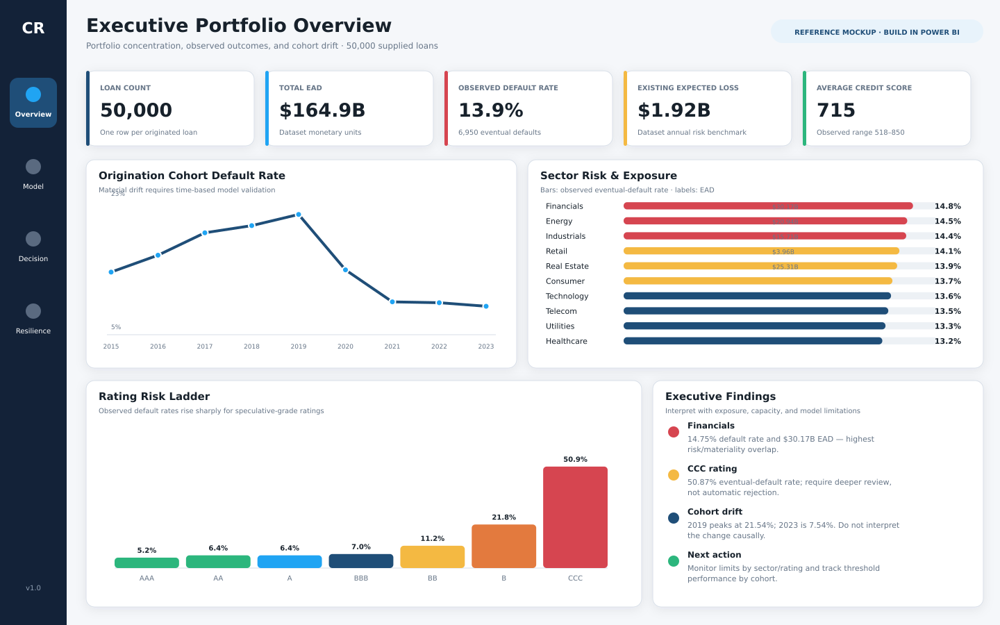
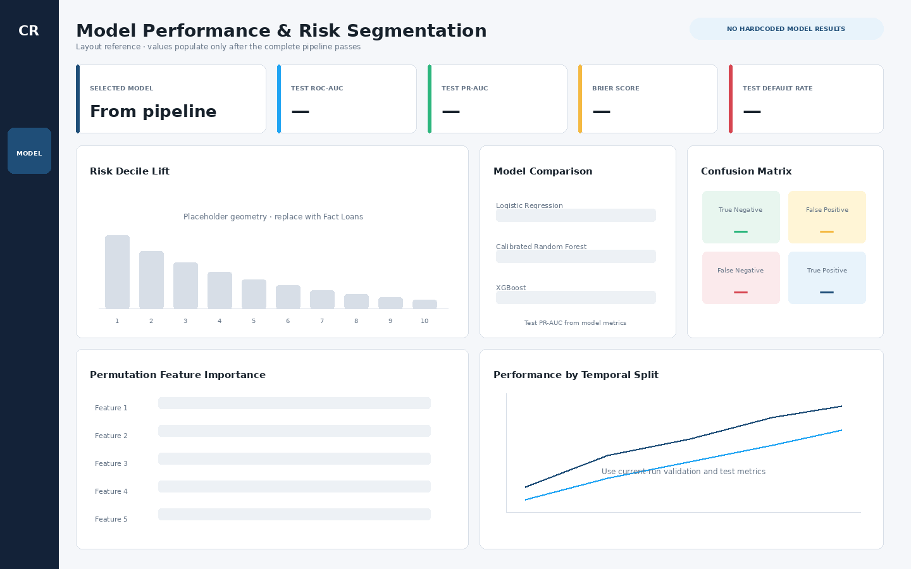
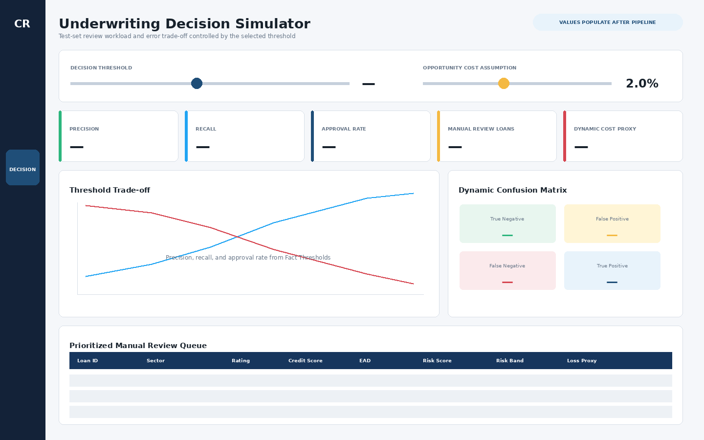
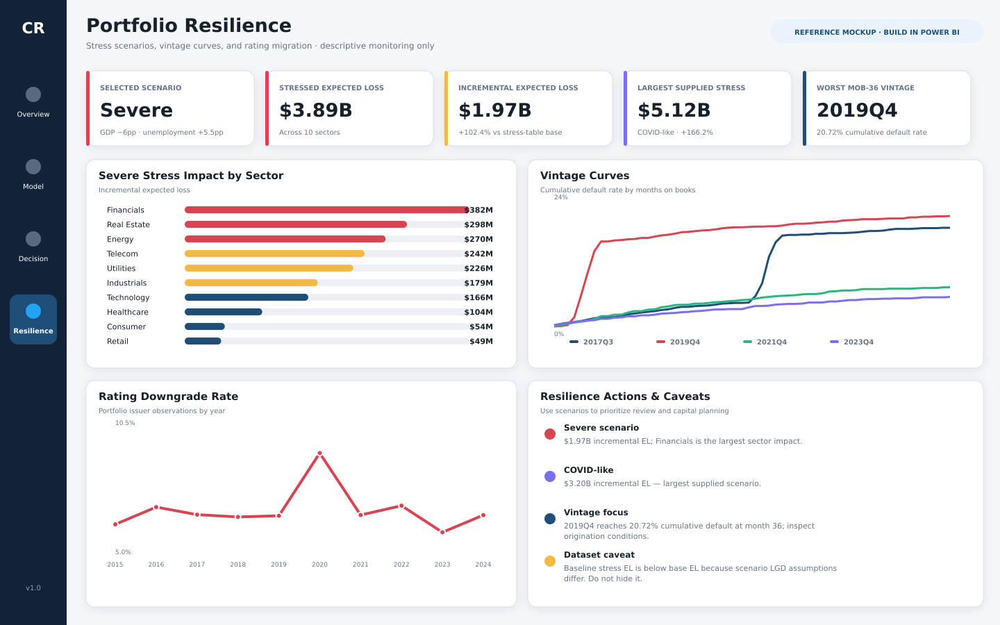

# Credit Risk Analysis

I built this project to analyze a loan portfolio, estimate contractual-term default risk, and support manual underwriting review. The project combines Python, PostgreSQL, SQL, machine learning, and Power BI in one reproducible workflow.

**Author:** Rafi Adabhi Sunarya  
**Project type:** Data analytics and machine learning portfolio project  
**Tools:** Python, PostgreSQL, SQL, and Power BI  
**Dataset size:** 50,000 loans across 10 sectors

> This ZIP contains the runnable project source only. It does not include the five raw CSV files, processed data, trained models, database credentials, generated Power BI workbook, or PBIX file. Those artifacts are created after the pipeline is run locally.

## What I built

- Audited and cleaned five related credit-risk datasets with Python.
- Loaded the cleaned data into a dedicated PostgreSQL `credit_risk` schema.
- Engineered leakage-safe application and origination-time features.
- Compared Logistic Regression, Calibrated Random Forest, and XGBoost using a temporal holdout.
- Selected the model using validation PR-AUC, with ROC-AUC as the secondary criterion.
- Created a recall-constrained operating threshold for manual-review prioritization.
- Wrote predictions, metrics, thresholds, and feature importance back to PostgreSQL.
- Built SQL reporting views and exported one centralized multi-table workbook for Power BI.
- Designed four Power BI report pages for portfolio overview, model performance, underwriting decisions, and portfolio resilience.

## Dashboard design preview

The Power BI blueprint, theme, and four reference layouts are included in [`dashboard/`](dashboard/). The images are design references; the final interactive PBIX is created after the pipeline has generated its data source.

### Executive Portfolio Overview



### Model Performance



### Underwriting Simulator



### Portfolio Resilience



The complete Power BI instructions, relationships, DAX measures, field placements, and validation checks are documented in [`POWER_BI_DASHBOARD_BLUEPRINT.md`](dashboard/POWER_BI_DASHBOARD_BLUEPRINT.md).

## End-to-end workflow


There is no CSV-only fallback. PostgreSQL is a required stage: model training reads the clean loan table from PostgreSQL, and the Power BI workbook is exported from PostgreSQL reporting objects.

## Required raw files

Place these files in `data/raw/` before running the project:

```text
loan_portfolio.csv
credit_ratings.csv
macro_stress_scenarios.csv
portfolio_metrics.csv
vintage_analysis.csv
```

The pipeline expects these exact filenames.

## Validated data audit

The source files were validated through the cleaning stage when this project structure was prepared. The ZIP intentionally excludes the raw and generated files.

| Dataset | Rows |
| --- | ---: |
| Loan portfolio | 50,000 |
| Credit ratings | 17,939 |
| Portfolio metrics | 120 |
| Stress scenarios | 60 |
| Vintage analysis | 2,160 |

Loan-level findings:

| Metric | Result |
| --- | ---: |
| Unique loans | 50,000 |
| Duplicate `loan_id` | 0 |
| Observed defaults | 6,950 |
| Overall default rate | 13.90% |
| Sectors | 10 |
| Origination period | 2015–2023 |

The source appears simulation-oriented. I use it to demonstrate credit-risk methodology and portfolio analysis, not to represent a real lender's production portfolio.

## Modeling scope

The unit of analysis is one originated loan. The target `defaulted` means default during the simulated contractual term; it is not a fixed 12-month probability of default.

### Leakage controls

I exclude fields that are only known after the outcome:

```text
default_date
survival_months
recovery_rate
loss_given_default
```

I also exclude existing risk-engine outputs from the model features:

```text
pd_annual
lgd
el
unexpected_loss
rwa
```

`pd_annual` remains available only as a supplied benchmark. It is not used to train the new model.

### Temporal validation

| Split | Origination period | Rows |
| --- | --- | ---: |
| Train | 2015–2020 | 33,359 |
| Validation | 2021 | 5,564 |
| Test | 2022–2023 | 11,077 |

Candidate models:

1. Logistic Regression;
2. Calibrated Random Forest;
3. XGBoost.

The model is selected by validation PR-AUC, with ROC-AUC used as the secondary criterion. The operating threshold maximizes validation precision while maintaining validation recall of at least 70%. The untouched test period is used only for final evaluation.

This source-only package does not hard-code the selected model, threshold, or test metrics. Those claims must come from the user's completed local run.

## Decision-output boundaries

- `default_probability` is a simulated contractual-term risk score.
- `term_risk_loss_proxy = default_probability × ead × lgd` is a prioritization proxy, not an accounting expected-loss estimate.
- The available actions are `Approve` and `Manual Review`; the project does not automate rejection.
- The analysis is descriptive and predictive, not causal.

## Evidence generated after the run

The included `.gitignore` is already configured so the following results can be committed to GitHub after the pipeline finishes:

| Evidence | Location | Purpose |
| --- | --- | --- |
| Five clean CSV files and audit report | `data/processed/` | Cleaning and data-quality evidence |
| Selected model and metadata | `models/` | Reusable trained artifact and modeling configuration |
| Centralized Power BI workbook | `data/outputs/credit_risk_powerbi_dataset.xlsx` | Final PostgreSQL-exported reporting source |
| Power BI PBIX, previews, theme, and documentation | `dashboard/` | Dashboard implementation and visual evidence |
| SQL and Python source | `sql/` and `src/` | Reproducible implementation |

Only raw source files, credentials, local environments, caches, and temporary files remain ignored.

## Technology responsibilities

| Tool | How I used it |
| --- | --- |
| Python | Data audit, cleaning, feature engineering, temporal splitting, model training, scoring, export, and validation |
| PostgreSQL | Persistent storage for clean data, predictions, model metrics, thresholds, and reporting objects |
| SQL | Schema constraints, portfolio aggregations, stress analysis, vintage analysis, rating migration, ranking, and Power BI views |
| Power BI | Data model, DAX, threshold simulation, model evaluation, portfolio monitoring, and interactive reporting |

The `.xlsx` file is a physical multi-table delivery format for Power BI, not a separate Excel-analysis workflow.

## Repository structure

```text
credit-risk-analysis/
├── dashboard/
│   ├── mockups/
│   │   ├── 01_executive_overview.png
│   │   ├── 02_model_performance.png
│   │   ├── 03_underwriting_simulator.png
│   │   └── 04_portfolio_resilience.png
│   ├── POWER_BI_DASHBOARD_BLUEPRINT.md
│   └── credit_risk_theme.json
├── data/
│   ├── raw/                  # add five source CSV files locally
│   ├── processed/            # generated clean files and audit evidence
│   └── outputs/              # generated centralized Power BI workbook
├── docs/
│   ├── CV_BULLETS.md
│   ├── DATA_AUDIT.md
│   ├── INTERVIEW_GUIDE.md
│   ├── MODEL_CARD.md
│   └── VALIDATION_REPORT.md
├── models/                   # generated selected model and metadata
├── sql/
│   ├── 01_schema.sql
│   ├── 02_business_queries.sql
│   ├── 03_powerbi_views.sql
│   └── 04_validation_queries.sql
├── src/
│   ├── 01_audit_clean.py
│   ├── 02_train_models.py
│   ├── 03_load_postgresql.py
│   ├── 04_build_powerbi_views.py
│   ├── 05_export_powerbi_data.py
│   ├── 06_validate_outputs.py
│   ├── config.py
│   └── db.py
├── .env.example
├── .gitignore
├── requirements.txt
├── START_HERE.md
└── run_pipeline.py
```

The historical filenames are preserved. Because model training must read PostgreSQL, the official execution order is controlled by `run_pipeline.py`: cleaning → PostgreSQL load → modeling → reporting views → export → validation.

## Run the project locally

### 1. Extract and open the project

Extract the ZIP so the project is located at:

```text
D:\Project\credit-risk-analysis
```

Open that folder in VS Code and start a PowerShell terminal.

### 2. Add the raw files

Copy the five required CSV files into:

```text
D:\Project\credit-risk-analysis\data\raw
```

Do not rename or manually edit them.

### 3. Create the Python environment

```powershell
cd "D:\Project\credit-risk-analysis"
py -m venv .venv
Set-ExecutionPolicy -Scope Process -ExecutionPolicy Bypass
.\.venv\Scripts\Activate.ps1
python -m pip install --upgrade pip
pip install -r requirements.txt
```

Verify the required libraries:

```powershell
python -c "import pandas, sklearn, xgboost, sqlalchemy, psycopg2, openpyxl; print('Environment ready')"
```

### 4. Create the PostgreSQL database

In pgAdmin 4, create:

```text
Database: credit_risk_db
Owner: postgres
```

The pipeline drops and rebuilds only the dedicated `credit_risk` schema. Do not store unrelated tables in that schema.

### 5. Configure the connection

```powershell
Copy-Item ".env.example" ".env"
code ".env"
```

Set the local PostgreSQL credentials:

```dotenv
PGHOST=localhost
PGPORT=5432
PGDATABASE=credit_risk_db
PGUSER=postgres
PGPASSWORD=YOUR_ACTUAL_POSTGRES_PASSWORD
```

Never commit `.env`.

### 6. Run the complete pipeline

```powershell
python run_pipeline.py
```

The command runs:

```text
01_audit_clean
03_load_postgresql
02_train_models
04_build_powerbi_views
05_export_powerbi_data
06_validate_outputs
```

The pipeline is complete only when validation returns:

```json
"status": "PASS"
```

## Run each stage manually

For easier debugging, use this exact order:

```powershell
python -m src.01_audit_clean
python -m src.03_load_postgresql
python -m src.02_train_models
python -m src.04_build_powerbi_views
python -m src.05_export_powerbi_data
python -m src.06_validate_outputs
```

Do not run model training before PostgreSQL loading.

## Centralized Power BI output

After a successful run, the only final data file in `data/outputs/` is:

```text
credit_risk_powerbi_dataset.xlsx
```

Power BI imports one workbook containing separate tables because loans, thresholds, metrics, portfolio history, stress scenarios, vintages, migrations, and feature importance have different grains. Stacking them into one flat CSV would produce invalid aggregations.

| Power BI table | Grain |
| --- | --- |
| `tblFact_Loans` | One originated loan |
| `tblFact_Thresholds` | One selected-model test threshold |
| `tblFact_ModelMetrics` | One model, split, and threshold type |
| `tblFact_Portfolio` | One portfolio month |
| `tblFact_Stress` | One scenario and sector |
| `tblFact_Vintage` | One vintage and months-on-books value |
| `tblFact_Migration` | One year and sector |
| `tblFeature_Importance` | One selected-model feature |

`tblManifest` is included for data lineage and validation, not as an analytical fact table.

## Open the output in Power BI

1. Open Power BI Desktop.
2. Select `Home > Get data > Excel workbook`.
3. Open `data\outputs\credit_risk_powerbi_dataset.xlsx`.
4. Select the eight analytical tables listed above.
5. Do not load `tblManifest` as a fact table.
6. Follow [`dashboard/POWER_BI_DASHBOARD_BLUEPRINT.md`](dashboard/POWER_BI_DASHBOARD_BLUEPRINT.md).

## PostgreSQL validation

In pgAdmin, open `credit_risk_db > Query Tool` and run:

```sql
SELECT
    COUNT(*) AS loans,
    COUNT(DISTINCT loan_id) AS unique_loans,
    SUM(defaulted) AS defaults,
    AVG(defaulted::numeric) AS default_rate
FROM credit_risk.loans;
```

Expected data-level result:

```text
loans       = 50,000
unique_loans = 50,000
defaults    = 6,950
```

After modeling, read the final model results from:

```sql
SELECT
    model_name,
    split,
    threshold_type,
    roc_auc,
    pr_auc,
    precision,
    recall,
    f1,
    brier_score
FROM credit_risk.model_metrics
ORDER BY model_name, split, threshold_type;
```

Do not copy model metrics from an earlier experiment. Use only the values generated by the successful local run.

## GitHub file policy after the run

The repository is ready to publish once the pipeline finishes:

- tracked: Python, SQL, README, documentation, processed CSVs, audit reports, generated Power BI workbook, selected model, model metadata, dashboard previews, theme, and PBIX file;
- ignored: raw source CSVs, `.env`, virtual environments, caches, editor files, and temporary Office/Power BI files.

Before committing, verify that no individual generated file exceeds GitHub's 100 MB per-file limit.

## Limitations

- The dataset appears simulation-oriented and should not be presented as real lender production data.
- The target represents default over the simulated contractual term, not fixed 12-month PD.
- Some reported maturity dates are capped at 31 December 2024; `maturity_months` is used for modeling.
- No protected-class fields are provided, so a complete fairness audit is not possible.
- The risk-loss measure is a prioritization proxy, not an accounting expected-loss calculation.
- The project does not claim deployment, real-time scoring, automatic rejection, production readiness, causal impact, or measured NPL reduction.

## Portfolio summary after validation

**Credit Risk Portfolio & Contractual-Term Default Scoring — GitHub | Power BI**

- Cleaned and validated 50,000 loans across 10 sectors using Python, engineered leakage-safe application features, and loaded five analytical datasets into PostgreSQL for SQL-based portfolio, stress, vintage, and migration analysis.
- Benchmarked Logistic Regression, Calibrated Random Forest, and XGBoost using a temporal holdout; selected `[MODEL]` with `[TEST PR-AUC]` PR-AUC and `[TEST ROC-AUC]` ROC-AUC, then built a centralized PostgreSQL-to-Power BI underwriting dashboard.

Replace the bracketed values only after `src.06_validate_outputs` returns `PASS`.
